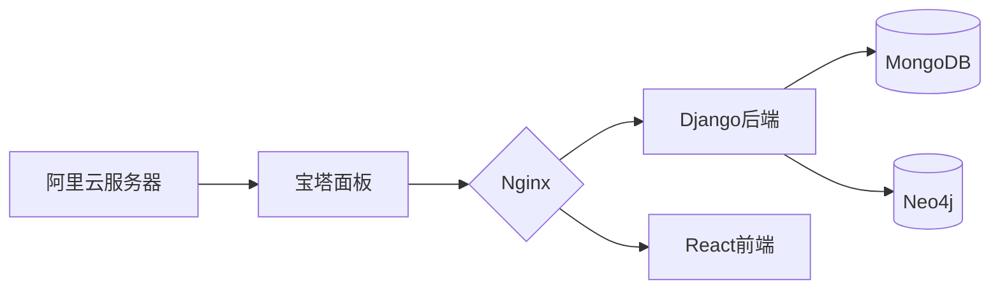

# 智能教育云平台  
**项目地址** ➤ [http://8.134.250.169](http://8.134.250.169)  

## 系统架构  

 

---

## 核心功能  

### 1. 学习数据仪表盘  


*学习数据仪表盘界面*  
- **数据闭环机制**：  
  `行为采集 → 可视化 → 策略调整 → 精准推荐`  
- **核心指标**：  
  ▸ 实时学习时长（当日/历史双维度统计）  
  ▸ 教材推荐权重（完成度×复习间隔算法）  
  ▸ 知识点关联图谱  

### 2. AI资源探索  


- 大模型驱动的对话系统  
- 学习路径智能规划  
- 历史对话存档与回溯  
- 资源获取路径分析  

### 3. 共享书城  


1. 筛选维度：学科/出版社/文件格式/标签
2. 卡片式教材展示
3. 一键加入书架功能
4. 模糊搜索（支持拼音首字母检索）
### 4. 个性书架  


- 自定义文件夹分类
- 预设「我喜欢的书籍」专区
- 最近阅读进度云端同步
- 本地书籍上传（支持epub/pdf/txt）
### 5. 教材阅读器

| 模式      | 功能描述                          |
|-----------|----------------------------------|
| **笔记**  | 实时批注与重点标记      |
| **脑图**  | 自动生成知识思维导图             |
| **助手**| 大模型即时答疑             |


### 6. 学习轨迹图谱
#### 核心能力
- **多维度学习追踪**  
  ▸ 时间维度：日/周/月颗粒度分析  
  ▸ 知识维度：结构掌握度可视化  
  ▸ 行为维度：学习路径模式识别

- **智能分析引擎**  
  ✅ 知识强弱项诊断  
  ✅ 学习效率评估（专注度/遗忘曲线）  
  ✅ 个性化推荐算法：


## 技术架构  
### 基础设施  


### 技术栈  
| 层级       | 技术组件                          |
|-----------|----------------------------------|
| **前端**  | React18 + Vite + AntDesign      |
| **后端**  | Django4 + DRF + JWT             |
| **数据库**| MongoDB6 + Neo4j5               |
| **运维**  | Docker + GitHub Actions         |

---

## 快速部署  
### 环境要求  
- Python ≥3.10  
- Node.js ≥18.x  
- MongoDB ≥6.0  

### 启动命令  
```bash
后端服务(进入backendprj/backendprj)
cd backend && pip install -r requirements.txt
python manage.py migrate
python manage.py runserver 0.0.0.0:8000

前端服务(在根目录下)
npm install
npm run dev 
```

